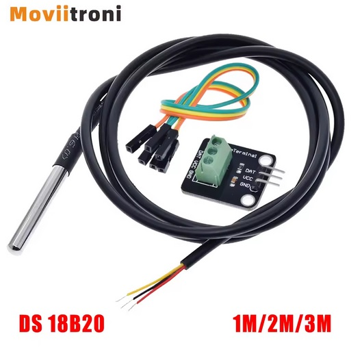
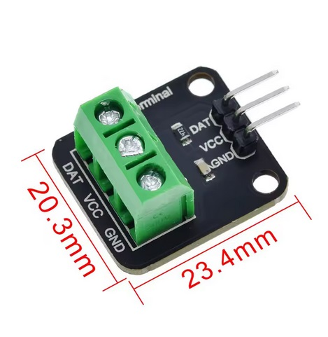
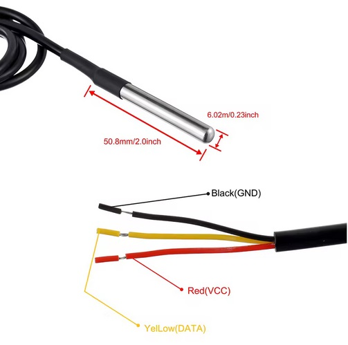
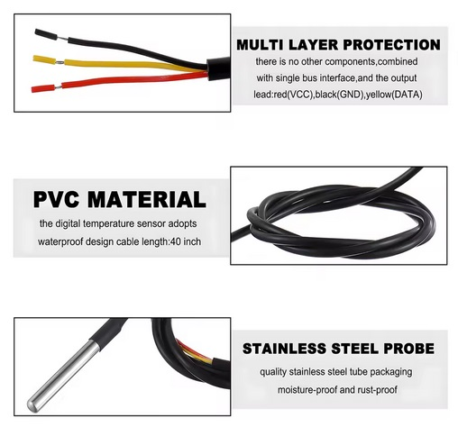
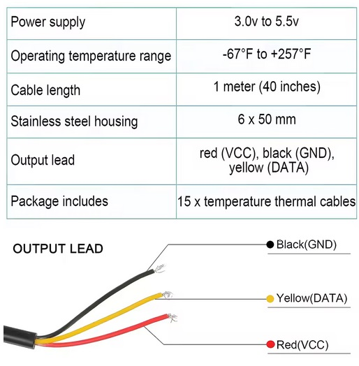

# Sensores  
**Sonda de sensor de temperatura DS 18B20**  
Sonda de sensor de temperatura DS 18B20, paquete de acero inoxidable, resistente al agua, 1m, 2m, 3m con módulo adaptador de terminal  
  
  
  
  
  

